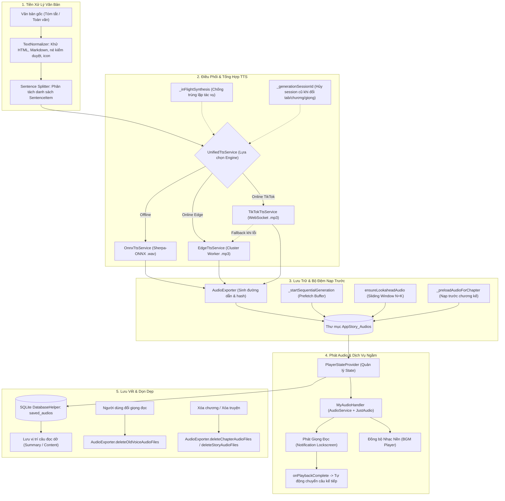

# Kiến Trúc & Vòng Đời Quản Lý Audio (Audio Lifecycle)

Tài liệu này mô tả chi tiết toàn bộ quy trình từ lúc văn bản được tiền xử lý, tạo âm thanh qua các engine TTS (Text-to-Speech), cơ chế bộ đệm nạp trước (lookahead/prefetch), quy ước lưu trữ và định danh file cache, luồng phát ngầm đồng bộ nhạc nền (BGM) cho đến cơ chế dọn dẹp bộ nhớ trong ứng dụng **SummaryStory**.

---

## 1. Sơ Đồ Tổng Quan Vòng Đời Audio (Audio Lifecycle Flow)



---

## 2. Chi Tiết Các Giai Đoạn Trong Vòng Đời Audio

### Giai Đoạn 1: Tiền Xử Lý & Phân Tách Câu (Text Normalization & Segmentation)

Trước khi văn bản được chuyển sang bộ tổng hợp giọng nói, hệ thống thực hiện làm sạch và chuẩn hóa chuyên sâu nhằm đảm bảo chất lượng đọc tốt nhất:

1. **Chuẩn hóa văn bản (`TextNormalizer.normalize`)**:
   - **Lọc ký tự rác:** Loại bỏ ký tự ẩn `zero-width`, `BOM`, soft hyphens và mã điều khiển.
   - **Xử lý định dạng:** Bóc tách thẻ HTML, giải mã thực thể HTML entities (`&amp;`, `&quot;`,...), loại bỏ cú pháp Markdown (`**`, `*`, `__`, `#`, `>`).
   - **Khử ký tự né kiểm duyệt:** Chuẩn hóa các từ bị chèn ký tự đặc biệt nhằm lách kiểm duyệt (ví dụ: `t·hi`, `t•hể`, `c*hết`, `s_át`, `g~iết`, `g.i.ế.t`, `m-á-u`, `đ|ánh`).
   - **Chuyển đổi từ vựng theo ngữ cảnh TTS:** Ví dụ chuyển `thi thể` $\to$ `chết` (bảo toàn định dạng hoa/thường).
   - **Khử từ cảm thán thừa:** Loại bỏ từ `a`/`A` đứng đơn lẻ cuối câu hoặc trước dấu kết câu.
   - **Lọc Icon & Emojis:** Xóa toàn bộ Emoji, Dingbats, ký tự hình học, nốt nhạc, biểu tượng tiền tệ.
   - **Chuẩn hóa dấu câu & khoảng cách:** Gộp dấu lặp (`???` $\to$ `?`, `....` $\to$ `...`), sửa dính chữ (`câu 1.câu 2` $\to$ `câu 1. câu 2`), bảo toàn số thập phân (`3.14`).

2. **Phân tách câu (`AppStateProvider.splitIntoSentences`)**:
   - Sử dụng Regular Expression tách câu theo dấu kết thúc hoặc dòng mới: `RegExp(r'(?<=[.!?…])\s+|\n+')`.
   - Gắn tiêu đề chương vào vị trí câu đầu tiên (`buildSentenceListWithHeader`) giúp giọng đọc phát rõ ràng tiêu đề chương khi bắt đầu.
   - Tạo danh sách `List<SentenceItem>`, mỗi câu bao gồm `index`, `text`, `audioPath`, `isGenerating`, `hasError`.

---

### Giai Đoạn 2: Quy Ước Đặt Tên & Quản Lý File Cache (`AudioExporter`)

Mọi file audio đều được lưu cục bộ trong thư mục riêng của ứng dụng:
- **Thư mục lưu trữ:** `<AppDocumentsDirectory>/AppStory_Audios/`

#### Cấu Trúc Tên File Audio Câu (`generateSentenceAudioFilePath`):
```text
<SafeStoryTitle>_C<ChapterNumber>_<TypeTag>_S<SentenceIndex>_<VoiceTag>_<HashTag>.<ext>
```
* **`SafeStoryTitle`**: Tên truyện đã được làm sạch ký tự đặc biệt của hệ điều hành (`[\\/:*?"<>|]`).
* **`ChapterNumber`**: Số thứ tự chương (VD: `C1`, `C25`).
* **`TypeTag`**: Phân biệt nguồn văn bản:
  - `TomTat`: Thuộc phần Tóm tắt chương.
  - `NoiDung`: Thuộc phần Toàn văn nội dung chương.
* **`SentenceIndex`**: Chỉ số thứ tự câu trong danh sách (VD: `S0`, `S1`, `S2`).
* **`VoiceTag`**: Mã định danh của giọng đọc (VD: `_edge-vi-VN-HoaiMyNeural`, `_onnx_bong_cuc`).
* **`HashTag`**: Mã băm Hex 16-bit từ nội dung câu (`sentenceText.hashCode.abs().toRadixString(16)`). Điều này đảm bảo khi nội dung câu thay đổi, file cache cũ sẽ không bị dùng sai.
* **`ext`**: Đuôi mở rộng:
  - `.mp3` cho Edge TTS và TikTok TTS.
  - `.wav` cho Offline ONNX TTS.

---

### Giai Đoạn 3: Cơ Chế Tổng Hợp TTS Đa Engine (`UnifiedTtsService`)

`UnifiedTtsService` đóng vai trò Bộ điều phối (Router) lựa chọn engine phù hợp theo `VoiceModel.engine`:

```
                    ┌─────────────────────────┐
                    │    UnifiedTtsService    │
                    └────────────┬────────────┘
                                 │
         ┌───────────────────────┼───────────────────────┐
         ▼                       ▼                       ▼
┌──────────────────┐   ┌──────────────────┐   ┌──────────────────┐
│  OnnxTtsService  │   │  EdgeTtsService  │   │ TikTokTtsService │
│  (Offline ONNX)  │   │ (Cluster Worker) │   │ (ByteDance WS)   │
└────────┬─────────┘   └────────┬─────────┘   └────────┬─────────┘
         │                      │                      │ (Nếu lỗi)
         │                      │                      └──────► Fallback Edge TTS
         ▼                      ▼                                 │
     File .wav              File .mp3                             ▼
                                                              File .mp3
```

1. **Local Offline ONNX (`OnnxTtsService`)**:
   - Sử dụng thư viện `sherpa_onnx` tương tác trực tiếp với C++ native binaries thông qua `dart:ffi`.
   - Tự động nạp/giải nén mô hình Piper ONNX từ assets/docs nếu chưa có trên thiết bị.
   - Tạo file `.wav` hoàn toàn offline mà không phụ thuộc vào kết nối mạng.

2. **Microsoft Edge TTS (`EdgeTtsService`)**:
   - Gửi yêu cầu qua cụm Cloudflare Workers (hơn 12 endpoint phân tán).
   - Tự động chuyển đổi round-robin sang worker tiếp theo khi gặp timeout hoặc lỗi HTTP.
   - Trả về luồng âm thanh định dạng `.mp3`.

3. **ByteDance / TikTok TTS (`TikTokTtsService`)**:
   - Kết nối thời gian thực qua giao thức WebSocket tới máy chủ ByteDance.
   - Nhận các khối nhị phân audio streaming, ghép thành file `.mp3`.
   - **Cơ chế dự phòng (Auto-Fallback):** Nếu WebSocket thất bại (hết token, mạng chặn), hệ thống tự động fallback mượt mà sang giọng tương đương của Edge TTS mà không làm gián đoạn người nghe.

#### Cơ chế Kiểm soát Đồng thời & Hủy Tác Vụ:
- **Chống gọi trùng lặp (`_inFlightSynthesis`):** Quản lý một `Map<String, Future<String?>>`. Nếu câu đang được nạp trước bởi tiến trình ngầm mà người dùng bấm phát, hệ thống sẽ tái sử dụng cùng một `Future` thay vì gửi thêm request thứ hai.
- **Cơ chế Ưu tiên (`isPriority`):** Câu mà người dùng đang chờ nghe ngay lập tức được cấp cờ `isPriority = true` để đẩy lên đầu hàng đợi.
- **Hủy tác vụ phiên cũ (`_generationSessionId`):** Khi người dùng chuyển chương, chuyển tab (Tóm tắt $\leftrightarrow$ Toàn văn) hoặc đổi giọng, `_generationSessionId` tăng lên. Tất cả các luồng đang chạy ngầm của session cũ sẽ tự hủy và dừng ghi đè state.

---

### Giai Đoạn 4: Bộ Đệm Nạp Trước & Cửa Sổ Trượt (Prefetch & Lookahead Buffer)

Để đảm bảo trải nghiệm nghe liên tục không độ trễ giữa các câu (0s latency):

```
Người dùng đang nghe: Câu [ i ]
                      │
                      ▼
Cửa sổ nạp trước:    [ i+1 ] ──► [ i+2 ] ──► [ i+3 ] ... ──► [ i + PrefetchCount ]
                     (Tải ngầm sẵn sàng trên đĩa)
```

1. **Khởi tạo buffer (`_startSummaryAudioGeneration` / `_startContentAudioGeneration`)**:
   - Ngay khi mở chương, hệ thống nạp trước $K$ câu đầu tiên ($K = \text{audioPrefetchCount}$, người dùng có thể tùy chỉnh từ 3 đến 10 câu trong Cài đặt).
2. **Cửa sổ trượt gối đầu (`ensureLookaheadAudio`)**:
   - Khi câu thứ $i$ bắt đầu phát, hệ thống kích hoạt luồng kiểm tra dải câu từ $i+1$ đến $i + K$.
   - Nếu câu nào chưa có file trên đĩa hoặc chưa có trong queue, tiến trình tổng hợp ngầm sẽ được khởi chạy.
   - Khoảng cách 50ms giữa các câu tổng hợp được thêm vào để nhường CPU/GPU rendering cho giao diện Flutter (đảm bảo 60/120 FPS).
3. **Nạp trước chương kế tiếp (`_preloadAudioForChapter`)**:
   - Khi người dùng nghe gần hết chương hiện tại, hệ thống kích hoạt nạp trước nội dung và các câu đầu tiên của chương tiếp theo vào bộ nhớ tạm `_preloadedNextChapter`.

---

### Giai Đoạn 5: Phát Audio, Đồng Bộ Nhạc Nền & Chạy Ngầm (Playback & Background Service)

1. **Kiến trúc Dịch Vụ Nền (`MyAudioHandler` & `AudioPlayerService`)**:
   - Sử dụng thư viện `audio_service` để đăng ký Android Foreground Service.
   - Hiển thị bảng điều khiển media trực tiếp trên màn hình khóa và thanh thông báo hệ thống (Notification bar) với đầy đủ các nút: Play, Pause, Rewind 10s, Forward 10s, Stop.
   - Giữ ứng dụng phát audio liên tục kể cả khi tắt màn hình hoặc chuyển sang ứng dụng khác.

2. **Đồng bộ Nhạc Nền (Background Music - BGM)**:
   - Sử dụng 2 luồng phát độc lập (`_player` cho giọng đọc và `_bgmPlayer` cho nhạc nền).
   - Tự động đồng bộ trạng thái: khi giọng đọc Pause $\to$ BGM tự Pause; khi giọng đọc Play $\to$ BGM tự động kích hoạt lặp vô hạn (`LoopMode.all`).
   - Hỗ trợ chỉnh âm lượng BGM riêng biệt (mặc định 20% - 30%) để không lấn át giọng đọc.

3. **Chuyển Câu Tự Động & Hẹn Giờ (Continuous Playback & Sleep Timer)**:
   - Khi `just_audio` phát hết câu hiện tại (`ProcessingState.completed`), `PlayerStateProvider` phát tín hiệu qua stream `onPlaybackComplete`.
   - `AppStateProvider` bắt sự kiện và ngay lập tức chuyển sang phát câu `sentenceIndex + 1`.
   - **Hẹn giờ tắt (Sleep Timer):** Đếm ngược theo thời gian định sẵn (15, 30, 45, 60, 90, 120 phút). Khi hết giờ, tự động dừng audio và giải phóng tài nguyên.

---

### Giai Đoạn 6: Lưu Vết Trạng Thái & Cơ Chế Dọn Dẹp (Persistence & Cleanup)

1. **Lưu Vết Lịch Sử & Vị Trí Nghe Dở (Database & Preferences)**:
   - Mỗi khi một câu được phát, `AppStateProvider` cập nhật vị trí vào CSDL SQLite (`DatabaseHelper`) và `SharedPreferences`.
   - Bảng `saved_audios` lưu độc lập:
     - `last_played_summary_index`: Vị trí câu nghe dở ở tab Tóm tắt.
     - `last_played_content_index`: Vị trí câu nghe dở ở tab Toàn văn.
     - `last_played_source`: Tab đang phát gần nhất (`summary` hoặc `content`).
   - Khi mở lại ứng dụng hoặc nạp lại chương, người dùng có thể tiếp tục nghe đúng câu đã dừng trước đó.

2. **Vòng Đời Dọn Dẹp & Xóa File Rác (`AudioExporter` & `DatabaseHelper`)**:

| Hành Động | Phương Thức Xử Lý | Phạm Vi Dọn Dẹp |
| :--- | :--- | :--- |
| **Đổi giọng đọc mới** | `AudioExporter.deleteOldVoiceAudioFiles` | Quét toàn bộ thư mục `AppStory_Audios` và xóa sạch các file audio thuộc giọng đọc cũ để tránh phình dung lượng bộ nhớ. |
| **Xóa một chương** | `AudioExporter.deleteChapterAudioFiles` + `db.deleteChapter` | Xóa tất cả file audio câu (`_C{num}_`) của chương đó trên đĩa và bản ghi trong CSDL. |
| **Xóa một truyện** | `AudioExporter.deleteStoryAudioFiles` + `db.deleteStory` | Xóa toàn bộ file audio gắn liền với tiêu đề truyện trên đĩa. |
| **Xóa toàn bộ thư viện** | `AudioExporter.deleteAllAudios` + `db.clearAll` | Dọn dẹp sạch sẽ toàn bộ thư mục `AppStory_Audios`. |

---

## 3. Bảng Tổng Hợp Các Lớp & File Liên Quan

| Thành Phần | Đường Dẫn File | Trách Nhiệm Chính |
| :--- | :--- | :--- |
| **Text Normalizer** | [`lib/core/utils/text_normalizer.dart`](file:///d:/Project/SummaryStory/lib/core/utils/text_normalizer.dart) | Chuẩn hóa, lọc ký tự né kiểm duyệt, làm sạch văn bản trước khi TTS. |
| **Audio Exporter** | [`lib/core/utils/audio_exporter.dart`](file:///d:/Project/SummaryStory/lib/core/utils/audio_exporter.dart) | Quy chuẩn đường dẫn, tạo mã băm hash câu, quản lý và xóa file trên đĩa. |
| **Unified TTS Service** | [`lib/services/unified_tts_service.dart`](file:///d:/Project/SummaryStory/lib/services/unified_tts_service.dart) | Router điều phối giữa ONNX (Offline), Edge TTS và TikTok TTS. |
| **ONNX TTS Service** | [`lib/services/onnx_tts_service.dart`](file:///d:/Project/SummaryStory/lib/services/onnx_tts_service.dart) | Tương tác sherpa-onnx native, giải nén model và tổng hợp offline `.wav`. |
| **Edge TTS Service** | [`lib/services/edge_tts_service.dart`](file:///d:/Project/SummaryStory/lib/services/edge_tts_service.dart) | Tổng hợp qua Cloudflare Worker cluster, xoay vòng server khi lỗi. |
| **TikTok TTS Service** | [`lib/services/tiktok_tts_service.dart`](file:///d:/Project/SummaryStory/lib/services/tiktok_tts_service.dart) | Tổng hợp qua WebSocket ByteDance, tự động fallback Edge TTS. |
| **Audio Handler** | [`lib/services/audio_handler.dart`](file:///d:/Project/SummaryStory/lib/services/audio_handler.dart) | Quản lý Foreground Service, Notification, điều khiển khóa màn hình & BGM. |
| **Audio Player Service** | [`lib/services/audio_player_service.dart`](file:///d:/Project/SummaryStory/lib/services/audio_player_service.dart) | Tầng trung gian điều khiển phát nhạc, seek, volume, speed, pitch. |
| **Player State Provider**| [`lib/providers/player_state_provider.dart`](file:///d:/Project/SummaryStory/lib/providers/player_state_provider.dart) | Quản lý trạng thái UI phát nhạc, thanh tiến trình, Sleep Timer. |
| **App State Provider** | [`lib/providers/app_state_provider.dart`](file:///d:/Project/SummaryStory/lib/providers/app_state_provider.dart) | Phân tách câu, quản lý session, lookahead buffer, chuyển câu tự động. |
| **Database Helper** | [`lib/core/database/database_helper.dart`](file:///d:/Project/SummaryStory/lib/core/database/database_helper.dart) | Lưu trữ thông tin metadata audio, câu nghe dở vào CSDL SQLite. |
